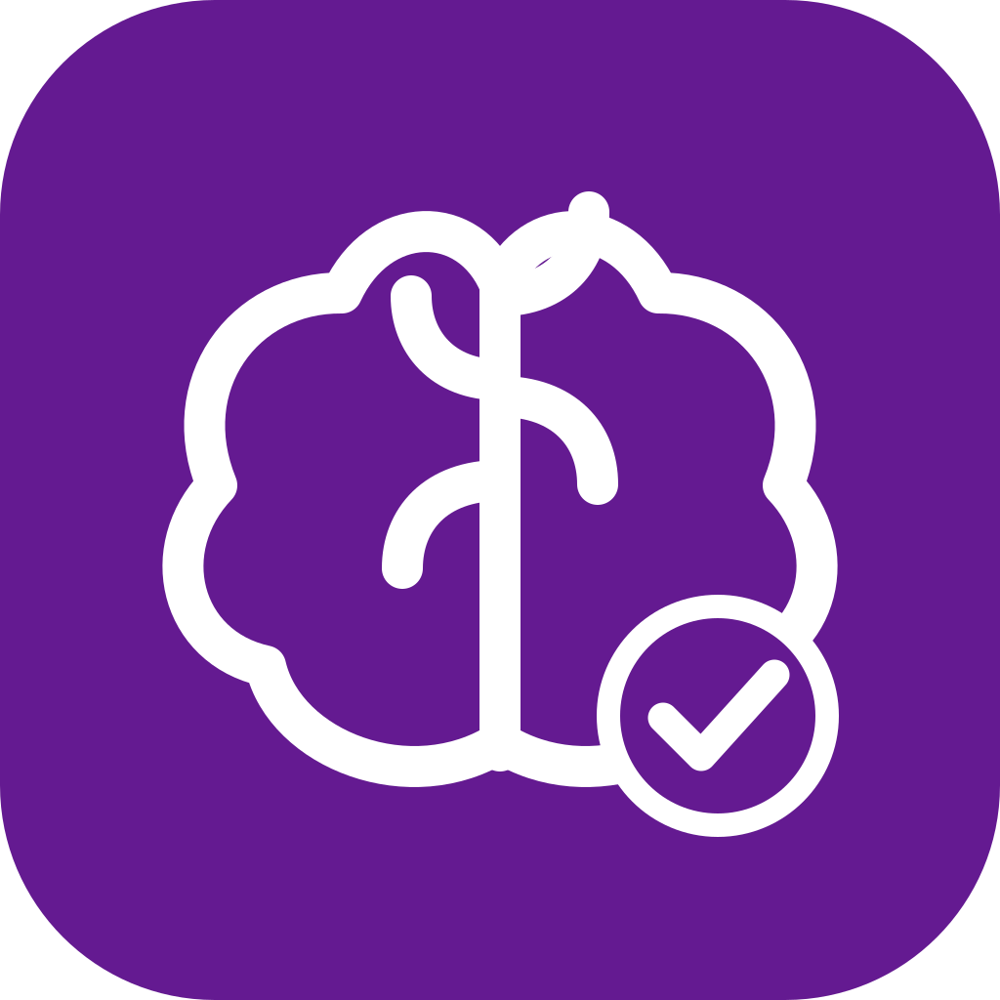

<div align="center">
  

  # CaliMind Downloads

  **Find your version. Download with confidence.**

  The official, responsive release portal for CaliMind.

  [](package.json)
  
  
  
</div>

## Overview

CaliMind Downloads helps people find the latest CaliMind app releases and
download the files attached to each release. It retrieves current public
release information through server-side Vercel functions instead of exposing
upstream repository links in the interface.

The portal is built with React, TypeScript, Vite, Tailwind CSS, and the
shadcn-style UI components already provided in `src/components/ui`. Its
responsive interface uses CaliMind's purple palette and glassmorphism styling.

## Features

- Browse current public releases, release notes, and downloadable assets.
- Search by release name, tag, notes, or asset filename.
- Filter by platform and optionally include pre-releases.
- Look up releases by their six-digit release code.
- Open dedicated release-detail pages and navigate without full-page reloads.
- Refresh automatically on page load, every five minutes, and when returning to
  an inactive tab; refresh manually at any time.
- Download assets in the page with transfer progress and visible error states.
- Learn about CaliMind and contact the developer from dedicated sections.
- Use the portal on desktop, tablet, and mobile.

## Get started

### Requirements

- Node.js 20 or later
- npm

### Install and run

```sh
npm install
npm run dev
```

Vite prints the local development URL after the server starts.

### Build and preview

```sh
npm run build
npm run preview
```

### Lint

```sh
npm run lint
```

## Releases and downloads

The portal checks for newly published releases automatically; the portal
version and CaliMind app versions are separate.

Release metadata and downloads are handled by same-origin Vercel functions.
Files are streamed through the portal, then buffered by the browser for
transfer progress and saved locally when complete. This avoids cross-origin
restrictions from upstream file hosts. Large downloads need enough browser
memory to buffer the file.

## Project structure

```text
src/
├── components/        Shared release, feature, issue, and footer components
├── components/ui/     Provided shadcn-style UI primitives
├── lib/               Release types and shared helpers
└── pages/             Home, About, Help, and release-detail pages
api/
├── releases.js        Server-side release metadata proxy
└── download.js        Server-side streaming download proxy
public/
├── images/            CaliMind app screenshots
└── calimind_logo.svg
```

## Report an issue

Use the **Found a problem?** section in the portal to contact the developer.
Do not include passwords, private notes, or other sensitive information in a
support request.

## Maintainer

The CaliMind product is developed by **Aventorgo LLC**.

[Aventorgo website](https://aventorgo.vercel.app/)

## License

This repository does not currently include a `LICENSE` file. No license to
reuse, modify, or redistribute the portal source is granted by this README.
